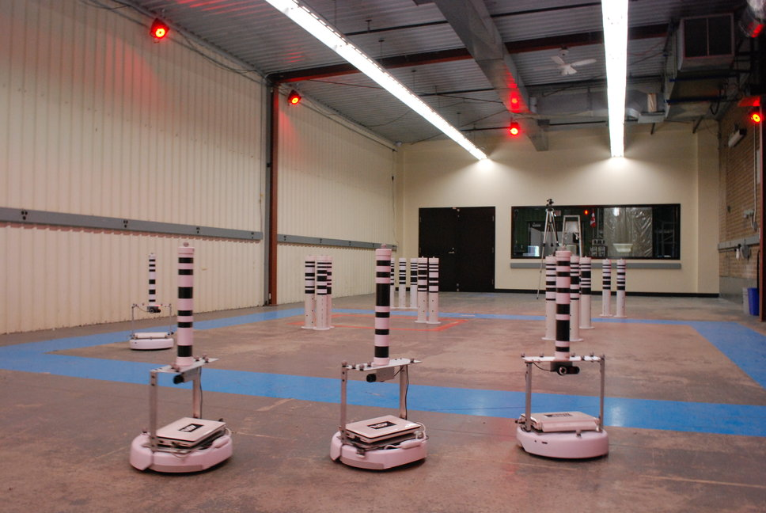
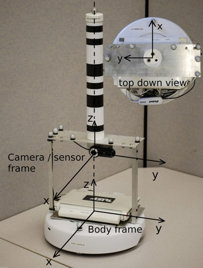
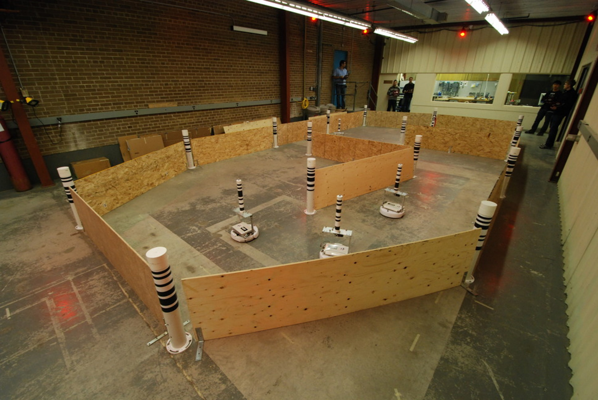

# L0. Introduction
In this lab session we will familiarize with the datasets that will be used further on in the course. First of all we will work on setting up our working environment, which will be based on python notebooks. Then, once completed the instalation we will start inspecting the datasets provided. 

The objective of this lab session is to understand the dataset specifications and select three groups of data with different properties to be used on the next laboratory sessions.

------------------------------------

## 1. Installation

### Clone the repository

    $ cd
    $ mkdir lib
    $ cd lib
    $ git clone git@github.com:ericguerrero/11765_MUSI.git

### Set python environment
Go to the repository directory and execute next commands.

    $ python3 -m venv env
    $ source env/bin/activate
    $ python3 -m pip install -r requirements.txt

In case you need extra packages install them using the following command.

    $ python3 -m pip install **name_of_a_packacge_you_need**

------------------------------------
## 2. Dataset
The 2d indoor dataset collection consists of 9 individual datasets. Each dataset contains odometry and (range and bearing) measurement data from 5 robots, as well as accurate groundtruth data for all robot poses and (15) landmark positions. The dataset is intended for studying the problems of cooperative localization (with only a team robots), cooperative localization with a known map, and cooperative simultaneous localization and mapping (SLAM).

### Data collection details
In each dataset, robots move to random waypoints in a 15m×8m indoor space while logging odometry data, and range-bearing observations to landmarks and other robots.

#### **Robots**
A fleet of 5 robots identical in construction and built from the iRobot Create (two-wheel differential drive) platform are used in producing the datasets. Each robot is equipped with a laptop computer and a monocular camera for sensing.

#### **Landmarks**
15 cylindrical tubes with the same dimensions are used as landmarks.

#### **Odometry**
Forward velocity (along the x-axis of the robot body frame) commands, v, and angular velocity commands (rotation about the z-axis of the robot body frame using right hand rule), ω, are logged at an average of 67Hz as odometry data.

#### **Measurements**
Each robot and landmark has a unique identification number encoded as a barcode (with known dimensions). Images captured by the camera on each robot (at a resolution of 960×720) are rectified and processed to detect the barcodes. The encoded identification number as well as the range and bearing to each barcode is then extracted. The camera on each robot is conveniently placed to align with the robot body frame.

#### **Occlusions**
In creating dataset 9, barriers were placed in the environment to occlude the robots' views. This reduced the number of measurements that the robots obtained. The robots also had to avoid these barriers while driving in the workspace. 

#### **Groundtruth**
A 10-camera Vicon motion capture system provides the groundtruth pose (x,y,θ) for each robot and groundtruth position (x,y) for each landmark at 100Hz with accuracy on the order of 1×10-3m. The reference frame used by Vicon serves also as the inertial reference frame in the datasets.

#### **Time Synchronization**
The Network Time Protocol (NTP) daemon is used to synchronize the clocks between the computers on each robot and the groundtruth data logging computer. Average timing error is on the order of 1×10-3s.

## 3. Files
Each dataset contains five files:
* **Odometry.dat**: Control data (translation and rotation velocity)
* **Measurement.dat**: Measurement data (range and bearing data for visually observed landmarks and other robots)
* **Groundtruth.dat**: Ground truth robot position (measured via Vicon motion capture – use for assessment only)
* **Landmark_Groundtruth.dat**: Ground truth landmark positions (measured via Vicon motion capture)
* **Barcodes.dat**: Associates the barcode IDs with landmark IDs.

The data is processed in the following way:
* Use all Odometry data
* Only use Measurement data for landmark 6 ~ 20 (1 ~ 5 are other robots)
* Use Groundtruth data to plot the robot state ground truth
* Use Landmark Groundtruth only for localization problem
* Associate Landmark Groundtruth with Barcodes to get landmark index from measurement
* Combine Odometry data with Measurement data ans sort by timestamp as input data
----------------------------------------------------------------------------------------

## 4. Exercise

For this lab session we will use the Lab0.ipynb notebook using Jupiter Lab. Execute the following command to open the web interface and open the notebook.

    $ jupyter-lab

Now take some time to inspect the contents of this notebook. 
### Create
